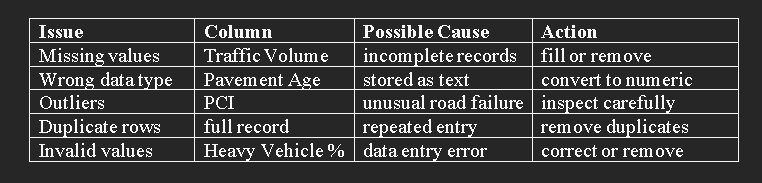

## Step 0 — Problem Framing

### Project title:

Predicting Pavement Condition Index (PCI) Using Machine Learning

### Problem statement:

Road agencies need a practical way to estimate pavement condition so they can prioritize maintenance before roads deteriorate too far. Manual PCI assessment is expensive, slow, and not always available for every road segment. In this project, students will build a regression model that predicts PCI from pavement, traffic, structural, environmental, and maintenance-related variables.

This fits your module exactly because the capstone is supposed to be an end-to-end machine learning project with data loading, cleaning, feature engineering, model training, evaluation, comparison, saving the model, and technical conclusions.

### Target variable:

PCI score, usually on a 0–100 scale.

### Practical meaning of the output:

The model should help answer:
“Given the current road conditions and history, what PCI is likely for this pavement section?”

### Engineering decision framing:

To make the project more meaningful, students should interpret PCI as:

PCI < 40 → poor condition, urgent intervention
PCI 40–70 → moderate condition, maintenance needed
PCI > 70 → good condition, low immediate risk

That turns the project from a pure prediction task into a maintenance support tool.

## Step 1 — Dataset Understanding and Hypothesis Formation

Before any coding, students should first understand what the dataset represents and what engineering behavior they expect to see.

### What students must identify

They should answer:

What does each row represent?
For example, one road section, one pavement sample, or one inspection record.
What does each feature mean physically?
Which variable is the target?
Which variables are likely to influence PCI most?
Example feature groups

### A good PCI dataset may include:

Pavement age
Traffic volume
Heavy vehicle percentage
Pavement thickness
Number of lanes
Subgrade strength / CBR
Rainfall or temperature
Years since last maintenance
Required hypotheses

Students should write 3 to 5 simple but meaningful hypotheses before looking too deeply at the data.

Example hypotheses:

#### Older pavements will have lower PCI.

#### Road sections with higher heavy-vehicle traffic will have lower PCI.

#### Thicker pavement layers will be associated with higher PCI.

#### Roads with recent maintenance will show higher PCI.

#### Poor subgrade strength will reduce PCI over time.

Why this step matters

This step forces students to think like engineers, not just coders. They are not merely fitting a model; they are testing whether the data behaves in a way that matches real pavement deterioration logic.

A short section like this:

The objective of this project is to predict Pavement Condition Index (PCI) using regression-based machine learning models. We assume that pavement age, traffic loading, structural properties, environmental exposure, and maintenance history influence PCI. The following hypotheses will be tested through exploratory data analysis and model building.

## step 2 — Data Loading and Initial Audit - setp2.py file

This step is about understanding the dataset before any cleaning or modeling. The goal is to check whether the data is usable, what problems exist, and what actions are needed before EDA and model training. That fits the course design, since the module requires data loading, cleaning, and preparation before model comparison.

## 2.1 Load the dataset

Students should load the CSV file with pandas and inspect the first few rows.

import pandas as pd

df = pd.read_csv("pavement_condition_data.csv")
df.head()

## 2.2 Basic structure check

They should inspect:

- number of rows and columns
- column names
- data types
- missing values
- df.shape
- df.info()
- df.isnull().sum()
- df.describe()

## 2.3 What students must look for

They should identify:

- columns with missing values
- numeric columns stored as text
- impossible values, such as negative traffic volume
- PCI values outside the valid range of 0 to 100
- duplicate records
- obvious outliers

### 2.4 Data Audit Table

A top student should not just inspect the dataset mentally; they should record the issues in a table like this:

## 2.5 What they should conclude

At the end of this step, students should write a short audit summary such as:

The dataset contains numerical pavement and traffic variables suitable for regression modeling. Initial inspection shows missing values, possible outliers, and a few columns requiring type correction. These issues must be handled before exploratory analysis and model training.

## 2.6 Why this step is important

This is where students prove discipline. Good machine learning starts with data quality, not with algorithms. A weak audit here will produce weak model results later.

## 2.7 Notebook section title

Use this exact heading in the notebook:
